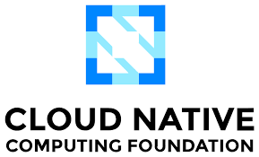

# Hi there 👋, I'm André

I'm a Platform Engineer with a passion for cloud-native technologies, automation, and building reliable, scalable systems. I thrive in environments that challenge me to learn and grow, and I'm always looking for opportunities to apply my skills to solve complex problems.

  

- 🔭 I’m currently working as a Platform Engineer, focusing on Kubernetes, GCP, and developer experience.
- 🌱 I’m always learning and exploring new technologies in the cloud-native landscape.
- 📫 How to reach me: [LinkedIn](https://www.linkedin.com/in/andr%C3%A9--ribeiro/)

---

### 🛠️ My Tech Stack

Here are some of the technologies I've been working with recently:

<table>
  <tr>
    <td align="center" width="96">
      
       GCP
    </td>
    <td align="center" width="96">
      
       Kubernetes
    </td>
    <td align="center" width="96">
      
       ArgoCD
    </td>
    <td align="center" width="96">
      
       Terraform
    </td>
    <td align="center" width="96">
      
       Ansible
    </td>
     <td align="center" width="96">
      
       GitHub Actions
    </td>
  </tr>
  <tr>
   <td align="center" width="96">
      
       Prometheus
    </td>
    <td align="center" width="96">
      
       Grafana
    </td>
     <td align="center" width="96">
      
       JFrog
    </td>
    <td align="center" width="96">
      
       Java
    </td>
    <td align="center" width="96">
      
       JavaScript
    </td>
    <td align="center" width="96">
      
       Python
    </td>
  </tr>
</table>

---

<table>
  <tr>
    <td><h3>💼 Professional Experience</h3></td>
    <td align="right"></td>
  </tr>
</table>

**Platform Engineer @ NOS** | *Sept. 2022 - Present*

- Responsible for the lifecycle of Kubernetes clusters across on-premise and cloud (GCP/GKE, Azure/AKS) and theirs all the environments (Development and production)
- Architecting and managing a comprehensive open-source observability stack.
- Enhancing developer experience through automation, CI/CD pipelines, and self-service platforms.
- Driving FinOps initiatives to optimize cloud infrastructure costs.
- Overseeing security posture using tools like Google Security Command Center and Wiz.
- Administering a large-scale GitHub organization on several aspects such as GH Actions, GHAS best practises and auth flows.

**Site Reliability Engineer @ NOS** | *Oct. 2019 - Sept. 2022*

- Managed and maintained critical platforms for over 3 million devices.
- Automated infrastructure provisioning and configuration management using Terraform and Ansible.
- Troubleshot and resolved issues in production Kubernetes environments.
- Developed internal tools and automation scripts in Java and Javascript.
- Participated in on-call rotations and led postmortem analyses.

**Trainee @ NOS ALFA Program** | *Oct. 2018 - Oct. 2019*

- Rotated between Operations and Value-Added Services teams.
- Developed a new information management system for CPEs.
- Contributed to projects involving chatbot development, process optimization, and platform engineering for contact center services.

---

<table>
  <tr>
    <td><h3>🎓 Education</h3></td>
    <td align="right"></td>
  </tr>
</table>

**Integrated Master’s in Electrical and Computer Engineering** | *Instituto Superior Técnico, University of Lisbon*

- Specialization: Telecommunications
- Master's Thesis: "Analysis and optimisation of antennas locations on trains from Mobile Communications (GSM-R, LTE-R and 5.9 GHz band)" (18/20)

**Extracurricular Experience (Athens Program)**
- **Czech Technical University (Prague)**: Management and Economics of the Enterprise (Mar 2017)
- **Institut d'Optique Graduate School**: The Engineer Tomorrow (Mar 2016)

---

### 📜 Certifications

- **GitHub Actions** (Dec 2024)
- **Certified Kubernetes Administrator (CKA)** (Sep 2024 & Dec 2020)
- **Google Cloud Certified: Professional Cloud Architect** (Nov 2023)
- **Google Cloud Certified: Professional Cloud DevOps Engineer** (Feb 2023)
- **Google Cloud Certified: Associate Cloud Engineer** (Sep 2022)
- **Certified Kubernetes Security Specialist (CKS)** (Dec 2021)
- **Microsoft Certified: Azure Fundamentals (AZ-900)** (Nov 2021)
- **HashiCorp Certified: Terraform Associate** (Jun 2021)

---

## Monitoring the Weekly Man Utd Outage for Faster Post-Mortems

### Premier League Standings

<!-- STANDINGS:START -->

| Pos |  Club  | P | W | D | L | GD | Pts |
|-----|------|----|---|---|---|----|----|
|  🟢 1 |  Arsenal FC | 17 | 12 | 3 | 2 | 21 | 39 |
|  🟦 2 |  Manchester City FC | 17 | 12 | 1 | 4 | 25 | 37 |
|  🟦 3 |  Aston Villa FC | 17 | 11 | 3 | 3 | 9 | 36 |
|  🟦 4 |  Chelsea FC | 17 | 8 | 5 | 4 | 12 | 29 |
|  🟨 5 |  Liverpool FC | 17 | 9 | 2 | 6 | 3 | 29 |
|  ⚪ 6 |  Sunderland AFC | 17 | 7 | 6 | 4 | 2 | 27 |
|  ⚪ 7 |  Manchester United FC | 17 | 7 | 5 | 5 | 3 | 26 |
|  ⚪ 8 |  Crystal Palace FC | 17 | 7 | 5 | 5 | 2 | 26 |
|  ⚪ 9 |  Brighton & Hove Albion FC | 17 | 6 | 6 | 5 | 2 | 24 |
|  ⚪ 10 |  Everton FC | 17 | 7 | 3 | 7 | -2 | 24 |
|  ⚪ 11 |  Newcastle United FC | 17 | 6 | 5 | 6 | 1 | 23 |
|  ⚪ 12 |  Brentford FC | 17 | 7 | 2 | 8 | -1 | 23 |
|  ⚪ 13 |  Fulham FC | 17 | 7 | 2 | 8 | -2 | 23 |
|  ⚪ 14 |  Tottenham Hotspur FC | 17 | 6 | 4 | 7 | 3 | 22 |
|  ⚪ 15 |  AFC Bournemouth | 17 | 5 | 7 | 5 | -3 | 22 |
|  ⚪ 16 |  Leeds United FC | 17 | 5 | 4 | 8 | -7 | 19 |
|  ⚪ 17 |  Nottingham Forest FC | 17 | 5 | 3 | 9 | -9 | 18 |
|  🔴 18 |  West Ham United FC | 17 | 3 | 4 | 10 | -16 | 13 |
|  🔴 19 |  Burnley FC | 17 | 3 | 2 | 12 | -15 | 11 |
|  🔴 20 |  Wolverhampton Wanderers FC | 17 | 0 | 2 | 15 | -28 | 2 |

<!-- STANDINGS:END -->

---
### ☁️ Cloud-Native & Open Source 4 the win

  

---